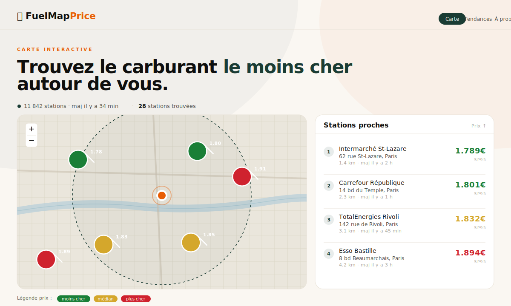

<div align="center">

# ⛽ FuelMapPrice

### Trouvez le carburant au meilleur prix, près de chez vous.

Une application web responsive qui s'appuie **exclusivement** sur les données officielles
[data.gouv.fr](https://www.data.gouv.fr/fr/datasets/prix-des-carburants-en-france-flux-instantane-v2/)
pour afficher, carte à l'appui, les stations-service françaises les moins chères
autour d'une ville de référence.

**Pas de compte. Pas de pub. Pas de tracking.** Juste de la donnée publique,
jolie à regarder et rafraîchie chaque heure.

[🚀 Démo en ligne](#-déploiement) ·
[✨ Fonctionnalités](#-fonctionnalités) ·
[🏗️ Stack](#️-stack-technique) ·
[⚙️ Développement local](#️-développement-local) ·
[📝 Versions](#-historique-des-versions) ·
[🙌 Contribuer](#-contribuer)

<br/>



</div>

---

## ✨ Fonctionnalités

### 🗺️ Onglet Carte — recherche géolocalisée

- Saisie d'une **ville de référence** avec géocodage automatique (Nominatim / OpenStreetMap)
- Autocomplétion intelligente : villes, départements, régions (désactivable dans les préférences)
- Bouton « **📍 Ma position** » pour utiliser la géolocalisation du navigateur
- Filtres en temps réel :
  - **Type de carburant** : SP95, SP98, Gazole, E10, E85, GPLc
  - **Prix maximum** au litre
  - **Rayon de recherche** de 5 à 50 km (ajusté automatiquement selon la zone)
- **Marqueurs colorés** selon le prix (vert = bon marché, ambre = médian, rouge = cher)
- **Liste latérale** des stations triées par prix croissant, cliquables pour zoomer sur la carte
- **Pop-up détaillé** : nom, adresse, prix, date de mise à jour, lien itinéraire (Google Maps / Apple Plans)
- **Clic sur la carte** : recentre automatiquement la recherche sur la ville cliquée

### 📈 Onglet Tendances — historique national

- Courbes de l'évolution des prix moyens, reconstituées **jour après jour**
- Sélection d'**un carburant** ou affichage **multi-courbes** (« Tous »)
- Périodes glissantes : **7 jours · 1 mois · 3 mois · 6 mois**
- Indicateurs colorés : prix **moyen**, **min** (vert), **max** (rouge) et **tendance** (▲ Hausse / ▼ Baisse / → Stable)

### 📱 Mobile — navigation par pages

Sur smartphone (< 1024 px), l'interface adopte une **navigation par pages** plutôt qu'un empilement vertical :

- **Page Recherche** : filtres + deux boutons d'action (Voir les stations / Voir la carte)
- **Page Stations** : liste plein écran des résultats
- **Page Carte** : carte Leaflet en pleine hauteur

Chaque sous-page dispose de boutons **← Retour** et **🏠 Accueil** en haut de l'écran. Le bouton retour du navigateur est aussi supporté via l'History API.

Sur desktop, tout reste affiché simultanément (carte + liste côte à côte).

### ⚙️ Préférences

- Suggestions de villes activables / désactivables
- Mémorisation locale (localStorage) optionnelle — aucune donnée ne quitte l'appareil
- Panneau « À propos » avec numéro de version et lien vers le changelog

### 🌙 Mode sombre

Activé automatiquement selon la préférence système (`prefers-color-scheme: dark`). Tous les éléments sont adaptés : carte, popups, graphiques, navigation mobile.

---

## 🏗️ Stack technique

Choix délibéré : **zéro build step**, zéro framework lourd.
Un simple hébergement statique (GitHub Pages) suffit.

| Couche             | Technologie                                       |
|--------------------|---------------------------------------------------|
| Structure          | HTML5 sémantique                                  |
| Style              | [Tailwind CSS](https://tailwindcss.com/) via Play CDN |
| Réactivité         | [Alpine.js](https://alpinejs.dev/) (6 KB gzip)    |
| Carte              | [Leaflet.js](https://leafletjs.com/) + tuiles OpenStreetMap |
| Graphiques         | [Chart.js](https://www.chartjs.org/)              |
| Typographie        | Bricolage Grotesque · Instrument Sans · JetBrains Mono |
| Géocodage          | [Nominatim](https://nominatim.org/) (OSM)         |
| Données prix       | `donnees.roulez-eco.fr` (flux officiel)           |
| Rafraîchissement   | **GitHub Actions** (Python 3.12, toutes les heures) |
| Hébergement        | **GitHub Pages**                                  |

### Pourquoi cette architecture ?

L'API de data.gouv.fr expose un fichier XML zippé qui n'autorise pas toujours
CORS, et qui pèse plusieurs Mo. Plutôt que de le charger côté client, une
**GitHub Action** tourne chaque heure :

1. Télécharge le flux officiel
2. Parse les ~11 000 stations
3. Produit un `stations.json` compact (~3 Mo)
4. Agrège la moyenne nationale du jour dans `history.json` (historique 6 mois glissants)
5. Commit les deux fichiers dans le repo

Le front se contente alors de `fetch('data/stations.json')` — simple, rapide, et
entièrement compatible avec un hébergement statique gratuit.

---

## 📁 Structure du projet

```
FuelMapPrice/
├── index.html                   # Point d'entrée — UI complète
├── css/
│   └── app.css                  # Styles custom (Leaflet, scrollbar, mobile nav, animations)
├── js/
│   ├── app.js                   # Composant Alpine principal + navigation mobile
│   ├── data.js                  # Chargement JSON + filtrage + Haversine
│   ├── geocoding.js             # Nominatim (ville → lat/lon) + autocomplétion
│   ├── map.js                   # Leaflet : marqueurs, cercle de rayon, popups
│   ├── preferences.js           # Gestion des préférences utilisateur
│   ├── trends.js                # Chart.js : courbes + KPIs + tendance
│   └── version.js               # Numéro de version et date de build
├── data/
│   ├── stations.json            # ⚙️ Généré par la GitHub Action
│   └── history.json             # ⚙️ Généré par la GitHub Action
├── scripts/
│   └── fetch-data.py            # Script Python : download + parse + agrégation
├── assets/
│   ├── favicon.svg              # Favicon SVG
│   └── preview.svg              # Aperçu pour le README
├── .github/workflows/
│   └── update-data.yml          # ⚙️ Workflow horaire
├── CHANGELOG.md                 # Historique des versions
├── LICENSE                      # MIT
└── README.md
```

---

## ⚙️ Développement local

Aucun outillage requis — un simple serveur HTTP statique suffit.

```bash
git clone https://github.com/lianazel/FuelMapPrice.git
cd FuelMapPrice

# Avec Python (déjà installé partout)
python3 -m http.server 8000

# ou avec Node
npx serve .
```

Ouvre ensuite <http://localhost:8000>.

### Générer manuellement les données

Si tu veux voir l'application avec des données réelles **avant** d'avoir déployé
la GitHub Action :

```bash
python3 scripts/fetch-data.py
```

Le script peuple `data/stations.json` et `data/history.json`. Recharge la page
et tout s'affiche.

---

## 🚀 Déploiement

### 1. Pousser sur GitHub

```bash
git init
git add .
git commit -m "feat: initial release"
git branch -M main
git remote add origin https://github.com/lianazel/FuelMapPrice.git
git push -u origin main
```

### 2. Activer GitHub Pages

Dans les **Settings** du repo → **Pages** :

- **Source** : `Deploy from a branch`
- **Branch** : `main` / `/ (root)`
- Sauvegarder

Le site est accessible quelques minutes plus tard à l'adresse
`https://lianazel.github.io/FuelMapPrice/`.

### 3. Activer la GitHub Action

La GitHub Action est **automatiquement active** dès le premier push (elle s'exécute toutes les heures).
Tu peux aussi la lancer manuellement depuis l'onglet **Actions** → **Update fuel data** → **Run workflow**.

> **Note** : le premier run prend ~30 secondes et commit un gros `stations.json`.
> Pour que l'Action puisse committer, la **permission** `contents: write` est
> déjà déclarée dans le workflow — elle fonctionne sans configuration
> supplémentaire sur les repos publics.

---

## 🙌 Contribuer

Les idées et les PR sont bienvenues. Quelques pistes d'évolution :

- [ ] **Favoris** (localStorage) : épingler ses stations habituelles
- [ ] **Export CSV** de la liste filtrée
- [ ] **Comparateur de trajets** : coût carburant entre deux villes
- [ ] **Alertes** : notification web si un prix passe sous un seuil
- [ ] **i18n** (EN / DE) — même données, plusieurs marchés

---

## 📝 Historique des versions

Les évolutions de l'application sont documentées dans [CHANGELOG.md](CHANGELOG.md),
qui suit la convention [Keep a Changelog](https://keepachangelog.com/fr/1.1.0/) et
le [versionnement sémantique](https://semver.org/lang/fr/).

---

## 📜 Licence & crédits

- **Code** : MIT (voir [LICENSE](LICENSE))
- **Données prix** : © [data.gouv.fr](https://www.data.gouv.fr) /
  [donnees.roulez-eco.fr](https://donnees.roulez-eco.fr) — Licence Ouverte 2.0
- **Fond de carte** : © [OpenStreetMap contributors](https://www.openstreetmap.org/copyright)
- **Géocodage** : [Nominatim](https://nominatim.org/)

<div align="center">

Fait avec ⛽ en France.

</div>
